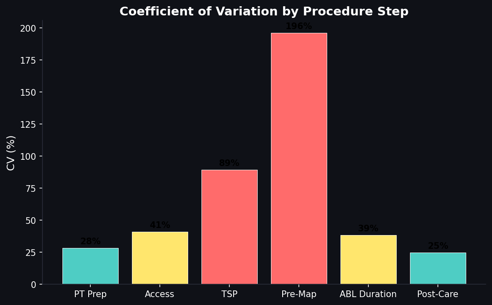
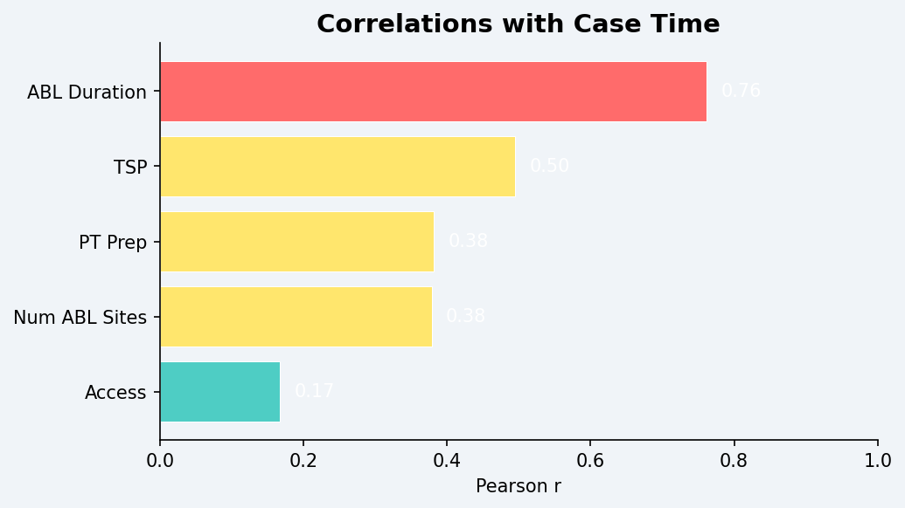

# EP Lab Procedural Efficiency Analysis

**[Live demo](https://mason-ep-lab-efficiency-analysis.streamlit.app/)**: runs in the browser, no install required.

Statistical analysis of **atrial fibrillation (AFib) ablation** procedure data
(**145 cases across 3 physicians, Jan – Oct 2025**), identifying bottlenecks
in electrophysiology lab operations and proposing data-driven scheduling
changes.

## Key findings

- **Catheter repositioning accounts for ~70 %** of total ablation time: the dominant intraoperative bottleneck.
- **Case complexity** (number of ablation sites × extra targets) explains **~40 %** of the inter-physician variance in Case Time. Raw physician differences are statistically significant (ANOVA p < 0.001) but largely attributable to case mix.
- **Pre-Map (CV ≈ 196 %)** and **TSP (CV ≈ 89 %)** are the most variable phases: both patient-anatomy dependent. Post-Care and PT Prep are protocol-driven and highly consistent.
- Simulated scheduling changes (complexity-based case ordering + warm-up compensation) project **~15 % reduction in average daily overruns**.




## Methods

| Analysis | Why |
|---|---|
| Descriptive statistics (mean ± σ, range) | Baseline scheduling intuition |
| Coefficient of variation by phase | Compare variability across phases with different scales |
| One-way ANOVA + pairwise t-tests | Is the physician effect real? |
| Pearson correlation + linear regression | Quantify complexity drivers of case time |
| Standard PVI vs. Extra-targets subgroup analysis | Attribute between-physician variance to case mix |
| Daily case-sequence analysis | Test first-case warm-up hypothesis |

## Repository layout

```
.
├── ep_lab_analysis.ipynb       ← main notebook (narrative + viz)
├── ep_lab_analysis.py          ← full statistical script (all tests + 5 charts)
├── ep_lab_app.py               ← Streamlit dashboard (interactive filters + what-if)
├── ep_lab_data.xlsx            ← 145-case dataset
├── cv_by_step.png              ← CV by procedure phase
├── correlations.png            ← Pearson correlations w/ Case Time
├── numabl_vs_casetime.png      ← NumABL linear-fit plot
├── standard_vs_extra.png       ← Standard PVI vs. Extra Targets
├── case_sequence.png           ← Daily case-sequence / warm-up
├── investigation_brief.md      ← problem framing & methodology brief
├── final_report.md             ← full written report (PCS framework + validation)
└── requirements.txt
```

## Run it

### Standalone scripts

```bash
pip install -r requirements.txt
python ep_lab_analysis.py            # prints full narrative + regenerates 5 figures
jupyter notebook ep_lab_analysis.ipynb
```

### Interactive dashboard

```bash
streamlit run ep_lab_app.py
```

The dashboard:

- **Physician + date filters + case-mix toggle** (all / Standard PVI / Extra targets): every chart and statistic recomputes immediately.
- **CV by phase**: colour-coded bar chart with the underlying mean / SD / CV table.
- **Physician comparison**: boxplot, group statistics, and live one-way ANOVA on Case Time with adjustable significance level.
- **Drivers**: Pearson correlations of every candidate driver with Case Time, plus a scatter with linear fit for any driver you select.
- **Daily sequence**: first-case warm-up effect plotted across the day.
- **Schedule what-if**: slide a warm-up allowance and re-order each day's cases by complexity; the dashboard projects how many days drop below the overrun threshold under the new schedule.
